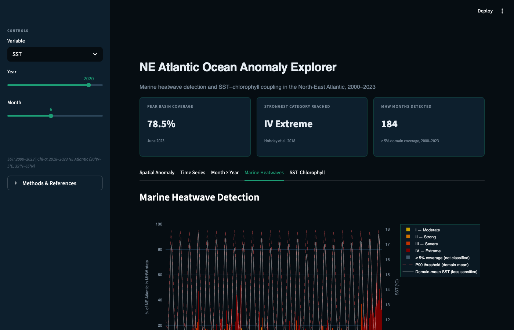

# nea-ocean-dashboard

An interactive Streamlit dashboard for exploring Sea Surface Temperature (SST) and Chlorophyll-a anomalies, marine heatwave events, and SST–chlorophyll coupling in the NE Atlantic (30°W–5°E, 35°N–65°N). Data are sourced from the Copernicus Marine Service and cached locally as Parquet files — no API credentials are needed to view the deployed app.

---

## Live demo

**https://nea-ocean-dashboard.streamlit.app/**

---

## Screenshot



---

## Data pipeline

Run the fetch script **once locally** to generate the cache files:

```bash
export COPERNICUSMARINE_SERVICE_USERNAME="your_username"
export COPERNICUSMARINE_SERVICE_PASSWORD="your_password"

python data_fetch.py
```

This writes two files to `data/` (gitignored):

| File | Copernicus Marine dataset ID | Variable | Period |
|---|---|---|---|
| `data/sst_monthly.parquet` | `cmems_mod_glo_phy_my_0.083deg_P1M-m` | `thetao` (surface) | 2000–2023 |
| `data/chl_monthly.parquet` | `cmems_mod_glo_bgc_my_0.25deg_P1M-m` | `chl` | 2018–2023 |

Free Copernicus Marine credentials: <https://data.marine.copernicus.eu/register>

---

## Run locally

```bash
pip install -r requirements.txt
streamlit run app.py
```

---

## Deploy to Streamlit Cloud

1. Temporarily remove `data/` from `.gitignore`, commit the parquet files, then push to GitHub.
2. Go to <https://share.streamlit.io> → **New app** → select this repo → `app.py`.
3. No secrets are required for the deployed app.

---

## Why this matters

The 2023 North Atlantic marine heatwave was a 276-year return-period event (Desc et al., *Science*, 2024) that set records across the entire basin simultaneously. It contributed to Europe's hottest summer on record, drove mass coral bleaching along the Azores and Canary Islands, disrupted cold-water fisheries from Ireland to Portugal, and accelerated North Atlantic hurricane intensification. Despite its scale, most publicly available marine heatwave tools either do not include it, rely on a 1982–2011 baseline that inflates cold-year thresholds, or apply only the Hobday 2016 binary flag without the 2018 severity categorization — making it impossible to distinguish the 2023 Extreme-category event from routine warm summers.

This dashboard is a methods demonstration as much as a visualisation. It implements the full Hobday 2016/2018 framework on a 2000–2020 reference baseline, applies a coherent-area filter to suppress spurious pixel-level extremes, and pairs the MHW detection with a lagged SST–chlorophyll cross-correlation that quantifies the ecological signal — the phytoplankton suppression that propagates up the food web weeks after the thermal anomaly peaks. The goal is to show that rigorous, reproducible MHW science is achievable with open reanalysis data and a few hundred lines of Python.

---

## Methods

### Anomaly calculation
Monthly SST and Chlorophyll-a anomalies are computed per grid cell by subtracting the long-term monthly climatological mean from each observation:

- **SST climatology baseline**: 2000–2020 (21 years)
- **Chlorophyll-a climatology baseline**: 2018–2022 (full available range; see Limitations)

### Marine heatwave detection
MHW detection follows **Hobday et al. (2016)** adapted to monthly resolution:

- **Threshold**: 90th percentile of SST values per (lat, lon, month) computed over the 2000–2020 baseline
- **MHW month**: any month where the spatially-averaged SST exceeds the spatially-averaged 90th-percentile threshold for that calendar month
- Consecutive MHW months are grouped into discrete events

### MHW categorization
Each MHW month is assigned a Hobday et al. (2018) intensity category based on a local delta (threshold_p90 − climatological_mean):

| Category | Intensity multiple |
|---|---|
| I — Moderate | 1 ≤ multiple < 2 |
| II — Strong | 2 ≤ multiple < 3 |
| III — Severe | 3 ≤ multiple < 4 |
| IV — Extreme | multiple ≥ 4 |

**Coherent-area filter (domain-specific adaptation):** The maximum local category is only assigned to a month when ≥ 5% of the NE Atlantic domain is simultaneously in MHW state. Hobday's per-pixel categorization was designed for site-level analysis; applying the basin-maximum over ~32,000 grid cells guarantees that at least one coastal or frontal pixel exceeds the extreme threshold in virtually every month, producing a spurious IV — Extreme classification even when the basin as a whole is not in MHW state. The 5% threshold suppresses these isolated outliers while preserving all coherent basin-scale events.

### SST–Chlorophyll-a coupling
The Coupling Analysis tab computes:

- **Pearson r** between spatially-averaged monthly SST and Chl-a anomalies over the 2018–2023 overlap period
- **Lagged cross-correlation** r(SST_t, Chl-a_{t+lag}) for lags −3 to +3 months
- Chlorophyll-a anomaly contrast between MHW and non-MHW months, with 2023 events highlighted

---

## Known limitations

| Limitation | Impact |
|---|---|
| **Monthly resolution** | The Hobday et al. (2016) standard requires *daily* SST and a 5-day minimum duration. Sub-monthly heatwaves are invisible; event statistics should be treated as indicative only. Daily satellite SST (e.g. OSTIA, CMC 0.1°) is required for rigorous detection (Schlegel et al. 2019). |
| **Chlorophyll baseline** | With data from 2018 only, the Chl-a climatology spans just 5 years (2018–2022), which is shorter than ideal and includes the anomalous 2023 warming — thresholds may be slightly inflated. |
| **Coarsened spatial resolution** | Every 2nd lat/lon grid point is retained to reduce file size. SST native resolution is 0.083° (~9 km); subsampled to ~18 km. |

---

## References

Hobday, A. J., Alexander, L. V., Perkins, S. E., et al. (2016). A hierarchical approach to defining marine heatwaves. *Progress in Oceanography*, 141, 227–238. <https://doi.org/10.1016/j.pocean.2015.12.014>

Hobday, A. J., Oliver, E. C. J., Sen Gupta, A., et al. (2018). Categorizing and naming marine heatwaves. *Oceanography*, 31(2), 162–173. <https://doi.org/10.5670/oceanog.2018.205>

Schlegel, R. W., Oliver, E. C. J., Hobday, A. J., Smit, A. J. (2019). Detecting marine heatwaves with sub-optimal data. *Frontiers in Marine Science*, 6, 737. <https://doi.org/10.3389/fmars.2019.00737>

Copernicus Marine Service (2023). The 2023 Northern Hemisphere Summer Marks Record-Breaking Oceanic Events. <https://marine.copernicus.eu/news/2023-northern-hemisphere-summer-record-breaking-oceanic-events>

England, M. H., Sen Gupta, A., Li, Z., et al. (2025). Drivers of the extreme North Atlantic marine heatwave during 2023. *Nature*, 642, 75–82. <https://doi.org/10.1038/s41586-025-08903-5>

---

## Related repos

- **[species-distribution-modeling](https://github.com/alvaropenuelas/species-distribution-modeling)** — MaxEnt / SDM with Sentinel-2 / GEE integration
- **[mediterranean-biodiversity-analysis](https://github.com/alvaropenuelas/mediterranean-biodiversity-analysis)** — benthic biodiversity assessment from photographic transects, Tenerife field data

---

*Data: Copernicus Marine Service — © E.U. Copernicus Marine Service Information*
